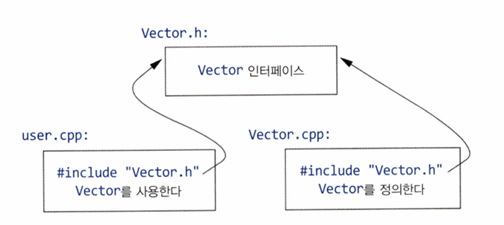

# 3강 : 모듈성 - 작성자: 이솔

<aside>

# 🔎 단원 요약

- 모듈성: 큰 프로그램을 여러 파일로 나누고 서로 충돌 없이 관리하는 방법
- 프로그램을 여러 부품으로 만들어서 인터페이스와 구현을 분리한다
</aside>

---

# 3.0 목차

| 3.2  | 분리 컴파일 | 부품을 파일로 나누기 |
| --- | --- | --- |
| 3.3  | 네임스페이스 | 부품끼리 이름 안부딪히게 |
| 3.4 | 함수 인수&반환 | 부품끼리 데이터 주고받기 |

# 3.2 분리 컴파일

#### 3.2.1 헤더 파일:

header file이라는 별개의 파일에 선언을 넣은 후, 선언이 필요한 곳에서 헤더 파일명으로 #include한다.



| 장점 | 단점 |
| --- | --- |
| 파일을 통해 종속성을 잘 정의한 모듈 집합으로 프로그램을 볼 수 있고, 분리 컴파일을 통해 이런 모듈성을 활용한다. | **컴파일 시간:** 독립적으로 컴파일되는 .cpp 파일(번역 단위)에 100번 #include하면 컴파일러는 include한 헤더의 텍스트를 100번 처리한다 |
| C 초창기 시절부터 사용했던 가장 일반적인 방법 | **순서 종속성:**먼저 #include한 헤더의 선언과 매크로가 나중에 선언된 코드의 의미를 바꿀 수 있다 |
|  | **비일관성:** 타입이나 엔티티를 한 파일에 정의한 후 조금 다르게 다른 파일에 정의하면 고장이나 오류로 이어질 수 있다. |
|  | **이행성:** 헤더 파일 내 선언 표현에 필요한 모든 코드는 그 헤더 파일에 제시해야 하며, 그렇지 않으면 헤더 파일이 다른 헤더를 include해 코드가 거대해진다 |

#### 3.2.2 모듈:

module 파일을 정의해 별도로 컴파일한 후, 필요한 곳에서 import한다. 

export한 선언만 import한 코드에 보여진다.


→ Vector 인터페이스는 컴파일러가 생성하지만 사용자가 명시적으로 명명하지는 않는다.

- 헤더와 달리 모듈을 정의할 때는 선언과 정의를 별도의 파일로 분리하지 않아도 된다.

# 3.3 네임스페이스

- 함수, 클래스, 열거 외에 서로의 이름이 충돌하지 않도록 표현하는 메커니즘

```jsx
import std;
using namespace std;

void print(){
	cout << "Hi";
}
```

- using 디렉티브를 사용하면 그 디렉티브를 둔 범위 안에서는 한정자 없이 명명한 네임스페이스의 이름에 접근할 수 있다.
- using 디렉티브를 사용하면 네임스페이스 내 이름을 선택적으로 사용할 수 없으므로 신중해야하며, 보통은 어플리케이션에 아주 흔한 라이브러리나 namespace를 사용하지 않았던 어플리케이션을 변환할 때 사용한다.

- 네임스페이스 안에 있는 이름들과 표준 라이브러리 이름이 동일하더라도 충돌하지 않는다.
- 다른 네임스페이스 내 이름에 접근할 때에는 네임스페이스명으로 그 이름을 한정한다.

```jsx
std::cout
My_code::main

namespace My_code{
	class complex {
		// ...
};

int main(){
	return My_code::main():
}

int My_code::main(){
	complex z {1,2};
	auto z2 = sqrt(z);
};
```

# 3.4 함수 인수와 반환값

#### 3.4.1 인수 전달

```cpp
int sum(const vector<int>& v){
	int s = 0;
	for(const int i : v)
		s += i;
	return s;
}

vector fib = {1,2,3,5,8,13,21}
int x = sum(fib);
```

sum의 결괏값 int는 sum() 밖으로 복사가능,
그러나 잠재적으로 아주 클 수 있는 vector를 sum()으로 복사하는 것은 비효율적이므로 인수를 참조

함수로 값을 넣을 때

1. 복사(값으로 전달)
2. 참조(호출자의 환경에서 객체 참조)

성능을 고려할 때 보통 복사 비용이 작으면(두 세 포인터 정도의 크기) 값으로, 크면 참조로 전달한다

성능상의 이유로 참조로 전달하고싶은데 인수를 수정하지 않을 때는 const 참조로 전달한다

함수 인수에 기본값을 기본 함수 인수로 명시할 수 있다.

```cpp
void print(int value, int base);

void print(int value) {
	print(value, 10);
}
```

```cpp
void print(int value, int base = 10);

print(x, 16); //16진수
print(x, 60); //60진수
print(x);     //10진수
```

#### 3.4.2 값 반환

계산한 결과 값을 함수 밖으로 꺼내 다시 호출자에게 돌려줄 때도 마찬가지로

복사가 값 반환의 기본 동작이며, 작은 객체에 가장 이상적인 방법

함수에 지역적이지 않은 객체에 호출자가 접근해야할 때만 참조로 변환

Vector 에서 사용자는 첨자 지정(subscripting)을 통해 원소에 접근할 수 있다.

```jsx
class Vector{
public:
	// ...
	double& operator[](int i) { return elem[i]; }; //i번째 원소로의 참조를 반환
private:
	double* elem; // elem은 sz크기의 배열을 가리킨다
	// ...
};
```

```jsx
int& bad(){
	int x;
	// ...
	return x;
}
```

대량의 정보를 함수 밖으로 전달할 경우 복사 대신 저렴하게 함수 밖으로 이동시키는 이동생성자를 제공한다.

```cpp
Matrix operator+(const Matrix& x, const Matrix& y){
	Matrix res;
	// ... for all res[i,j], res[i,j] = x[i,j]+y[i,j] ...
	return res;
}

Matrix m1, m2;
Matrix m3 = m1 + m2; //복사하지 않음
```

```cpp

Matrix* add(const Matrix& x, const Matrix& y){
	Matrix* p = new Matrix;
	// ... for all *p[i,j], *p[i,j] = x[i,j]+y[i,j] ...
	return p;
}

Matrix m1, m2;
Matrix* m3 = add(m1,m2); // 단순히 포인터를 복사
delete m3;               // 쉽게 잊어버림
```

#### 3.4.3 반환 타입 추론

함수의 반환값으로부터 반환 타입을 추론할 수 있다.

```cpp
auto mul(int i, double d) { return i*d; }; //여기서 auto는 반환 타입을 추론한다는 뜻
```

특히 제네릭 함수와 람다 구현이 바뀌면 타입도 바뀔 수 있는 등 추론된 타입이 안정적인 인터페이스를 제공하지 않는 것을 주의하자.

#### 3.4.4 후위 반환 타입

인수를 보고 결과 타입을 결정해야할 때가 있다.

반환 타입을 명시하고 싶으면 인수 목록 뒤에 반환 타입을 추가하면 된다.

그럼 auto는 “반환 타입을 나중에 언급하거나 추론하겠다”로 해석된다.

```cpp
auto mul(int i, double d) -> double { return i*d; } // 반환 타입은 double
```

*차이점

```jsx
decltype(i*d) mul(int i, double d) { return i*d; }
//   여기 i, d 적는 순간엔 아직 i,d가 선언 안 됨 (뒤에 나옴) → 못 씀

auto mul(int i, double d) -> decltype(i*d) { return i*d; }  
//                           i,d 다 선언된 뒤라서 i*d 써먹을 수 있음
```

반환 타입이 뭐가 될지 컴파일러도 몰라서 `decltype`으로 계산해야 함 → 그러려면 매개변수가 먼저 선언되어 있어야 함 → 후위 문법 필요

```cpp
template<typename T, typename U>
auto mul(T i, U d) -> decltype(i*d) {
    return i*d;
}
```

여기서 `T`, `U`는 호출할 때까지 뭐가 될지 모름. `int * double`일 수도, `Matrix * Vector`일 수도, `Complex * int`일 수도 있다. 

반환 타입이 매개변수 타입들의 연산 결과에 의존하는데, 그 연산 결과 타입을 미리 알 수 없는 제네릭 코드에서 쓰는 문법

#### 3.4.5 구조적 바인딩

함수는 멤버를 여러 개 포함하는 클래스 객체를 값으로 반환할 수 있다.

```cpp
struct Entry { string name; int value; };
Entry read_entry(istream& is){
	string s;
	int i;
	is >> s >> i;
	return {s,i};
}

auto e = read_entry(cin);

cout << "{" << e.name << " , " << e.value << " }\n";
```

```cpp
auto [n,v] = read_entry(is);
cout <<"{" n << " , " << v << "}\n";
```

auto [n,v]는 두 지역변수 n,v를 선언하는데, 각각의 타입은 read_entry()의 반환타입으로부터 추론한다. 클래스 객체의 멤버에 지역명을 부여하는 이러한 메커니즘을 구조적 바인딩(structured binding)이라고 한다.

```cpp
complex<double> z  = {1,2};
auto [re,im] = z+2; //re = 3; im = 2;
```

멤버 함수를 통해 접근하는 클래스도 처리할 수 있다.