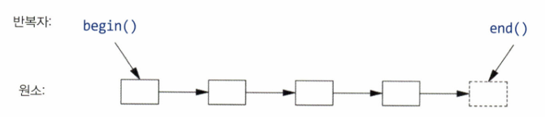

# 13강 : 알고리듬 - 작성자: 이솔

<aside>

# 🔎 단원 요약

- 반복자(iterator) : 알고리즘과 컨테이너가 서로를 전혀 몰라도 일할 수 있게 중간에서 다리 역할
</aside>

---

## 13.1 소개

### 왜 알고리즘이 필요한가

```cpp
void f(vector<Entry>& vec, list<Entry>& lst)
{
    sort(vec.begin(), vec.end());                      // vec를 정렬
    unique_copy(vec.begin(), vec.end(), lst.begin());   // 중복 없이 lst로 복사
}
```

정렬하고 같은 번호가 연속으로 나오면 한 장만 넣는 함수

여기서 `Entry`라는 사용자 타입을 정렬하려면, 컴퓨터한테 적다(<)와 동등(==)을 알려줘야함 → 직접 정의

```cpp
bool operator<(const Entry& x, const Entry& y) { 
	return x.name < y.name;                             //이름순으로 정렬
}
```

### 반개구간(half-open range)

표준 알고리듬은 원소 시퀀스로 표현되며, 시퀀스는 첫 번째 원소와 마지막 원소 바로 다음을 명시하는 반복자 쌍



sort()는 반복자 쌍 vec.begin()과 vec.end()로 정의된 시퀀스를 정렬하지만, lst에 작성할 떄는 작성하려는 첫 번째 원소만 명시하면 됨

원소를 둘 이상 작성할 경우 최초 원소 뒤에 나오는 원소들을 덮어쓴다.

→ 오류를 피하려면 lst 원소 수 ≥ vec 내 고유한 값 수

표준 라이브러리 컨테이너는 범위를 검사해 작성하는 추상을 지원하지 않음. 직접 정의하면 아래와 같다


→ 표준 알고리즘은 입력 범위는 알지만, 출력할 공간이 충분한지는 확인하지 않는다.

해결법

```cpp
copy(v1.begin(), v1.end(), back_inserter(v2));
```

### back_inserter

back_inserter(res)호출은 res에 반복자를 생성해 컨테이너 끝에 원소를 추가하고, 원소를 넣을 공간을 만들기 위해 컨테이너를 확장한다. 

→ 미리 정해진 양의 공간을 할당하고 채우지 않아도 됨

sort(vec.begin(), vec.end())가 번거로우면 범위 기반 알고리듬을 이용해 sort(vec)로 치환 가능(13.5절)

```cpp
for(auto& x : v) cout<<x; //v의 모든 원소를 작성한다
for(auto p = v.begin(); p!=v,.end(); ++p) cout<<*p; //v의 모든 원소를 작성한다
```

* 컨테이너는 그냥 담는 곳이다. 정렬이나 복사, 중복 제거같은 일은 알고리즘이 한다.

## 13.2 반복자 사용

컨테이너에는 유용한 원소들을 참조하는 몇 가지 반복자가 있다.

find() : 시퀀스에서 값을 검색해 발견한 원소들의 반복자를 반환한다.

문자열에서 문자 하나 찾

```cpp
bool has_c(const string& s, char c)
{
    auto p = find(s.begin(), s.end(), c);
    if(p!=s.end()) return true;
}
```

```cpp
// s가 문자 c를 포함하는가?
bool has_c(const string& s, char c)
{
	return find(s,c)!=s.end();
}
```

표준 알고리즘은 검색 실패 시 거의 항상 `end()`를 돌려줌

이 글자가 나오는 모든 자리를 함수로 확장하면 아래와 같다.

```cpp
vector<string::iterator> find_all(string& s, char c) //s에서 c가 나오는 위치를 모두 찾는다
{
	vector<char*> res;
	for (auto p = s.begin(); p!=s.,end(); ++p)
		if(*p==c)
			res.push_back(&*p);
		return res;
}
```

일반적인 루프로 문자열을 순회하며 ++를 이용해 반복자 p를 한 번에 원소 하나씩 앞으로 이동하고 역참조 연산자 *로 원소들을 살펴본다. 테스트하면

```cpp
void test(){
	string m {"Mary had a little lamb"};
	for (auto p : find_all(m, 'a'))
		if (*p!='a')
			cerr << "a bug!\n";
}
```


이걸 사용하면 알맞을 모든 표준 컨테이너에서 동등하게 동작하도록 일반화하면 아래와 같다.

```cpp
template<typename C, typename V>

vector<typename C::iterator> find_all(C& c, V v) // c에서 v가 나오는 모든 위치를 찾는다
{
    vector<typename C::iterator> res;
    for (auto p = c.begin(); p != c.end(); ++p)
        if (*p == v) res.push_back(p);
    return res;
}
```

컴파일러에게 C의 iterator가 하나의 타입임을 알리려면  typename이 필요하다(정수가 아님을 증명)

* 반복자는 알고리듬과 컨테이너를 분리시킨다. 알고리듬은 반복자를 통해 데이터를 처리하므로 원소가 저장된 컨테이너에 대해 모르고, 컨테이너도 원소에 어떤 알고리듬이 수행되는지 모른다.

** 이러한 데이터 저장소와 알고리듬 간 분리 모델은 매우 일반적이로 유연한 소프트웨어로 이어진다.


## 13.3 반복자 타입

반복자는 컨테이너마다 내부 구현은 다르지만 같은 인터페이스를 제공하기 때문에 알고리즘을 하나만 만들어도 된다.

모든 반복자는 어떤 타입의 객체이다. 특정 컨테이너 타입을 처리하는 데 필요한 정보를 담고 있어야한다.

ex) vector의 원소는 포인터로 참조하면 알맞으니,  vector의 반복자는 평범한 포인터 or 포인터 + 인덱스


ex2) list의 반복자는 원소의 포인터만으로는 부족하다. `list`는 물건들이 메모리 여기저기 흩어져 있고, 각 칸이 다음 칸이 어디 있는지의 링크만 알고 있으므로 반복자도 이 링크를 따라 이동하는 객체여야 한다.


시맨틱과 연산의 명명은 모든 반복자에 공통이다. 어느 반복자에 ++를 사용하든 다음 원소를 참조하고, *를 사용하면 반복자가 참조하는 원소를 내놓는다. 

다양한 종류의 반복자를 forward_iterator, random_access_iterator같은 표준 라이브러리 concept로 사용할 수 있으며(14.5절), 각 컨테이너는 자신의 반복자 타입을 알고있고, 관례적으로 iterator와 const_iterator라는 이름으로 정의되어있어 사용자가 특정 반복자의 타입에 대해 거의 알 필요가 없다.

ex) list<Entry>::iterator는 list<Entry>의 일반적인 반복자 타입이지만, 그 타입이 세부적으로 어떻게 정의되는지 몰라도 됨

### 13.3.1 스트림 반복자

파일과 화면도 같은 방식으로 다룰 수 있다.

cout이나 cin도 반복자로 다룰 수 있음

```cpp
ostream_iterator<string> oo {cout};   // cout에 문자열을 쓰는 반복자
*oo = "Hello, ";   // cout << "Hello, " 와 동일한 효과
++oo;
*oo = "world!\n";
```

*oo에 문자열을 할당하면 할당된 값이 cout에 작성됨

컨테이너에 쓰나 화면에 출력하나, 알고리즘 입장에서는 똑같은 동작

++oo는 포인터를 이용해 배열에 작성하듯이 문자열을 스트림에 작성한다.

비슷하게 istream_iterator는 입력 스트림을 읽기 전용 컨테이너처럼 다루게 해준다.

파일을 읽어 단어를 정렬한 후 중복 제거하고 그 결과를 다른 파일에 작성하는 프로그램

```cpp
int main()
{
    string from, to;
    cin >> from >> to;
    ifstream is {from};
    istream_iterator<string> ii {is};
    istream_iterator<string> eos {};
    ofstream os {to};
    ostream_iterator<string> oo {os, "\n"};

    vector<string> b {ii, eos};   // 파일 내용을 통째로 vector에 읽어들임
    sort(b);
    unique_copy(b, oo);           // 정렬 + 중복 제거해서 파일로 씀
    return !is.eof() || !os;
}
```

## 13.4 프레디킷 사용

알고리즘이 사용할 조건을 사용자가 직접 넘길 수 있다

각 원소에 수행할 동작을 내장시키는 것이 아니라 그 동작을 알고리듬의 인자로 넣고싶다면 predicate을 충족하는 원소를 찾으면 된다.

find는 이 값과 똑같은 값만 찾을 수 있었지만, 42보다 큰 첫 값을 찾고싶으면 find_if 를 사용한다.

```cpp
struct Greater_than {
    int val;
    Greater_than(int v) : val{v} {}
    bool operator()(const pair<string,int>& r) const { return r.second > val; }
};

auto p = find_if(m, Greater_than{42});   // map에서 값이 42보다 큰 첫 항목
```

7.3.2절에서 배운 람다식을 사용해도 동등하다.

```cpp
auto p = find_if(m, [](const auto& r){ return r.second > 42; });
```

* 조건 검사(프레디킷)는 검사만 해야지, 검사하는 대상 값을 몰래 수정하면 안됨

## 13.5 알고리듬 개요

알고리듬: 특정 문제 집합을 해결하는 연산 시퀀스를 제공하는 유한 규칙 집합 → 시퀀스에 대해 동작하는 함수 템플릿 모음

명확성, 입력, 출력, 유한성, 유효성이라는 다섯 가지 중요한 특징을 지닌다.


* 이 알고리즘들 중 어느 것도 컨테이너에서 데이터를 새로 쓰거나 지우지 않는다. 시퀀스(반복자 쌍)는 자기가 어느 컨테이너에서 왔는지 전혀 모르기 때문에, 추가나 삭제 자체가 정의될 수 없다.

** 정말 추가/삭제하려면 `back_inserter`처럼 컨테이너를 아는 도구를 쓰거나, `push_back()`/`erase()`처럼 컨테이너를 직접 불러야 함

## 13.6 병렬 알고리듬

여러 데이터 항목에 동일한 작업을 수행할 때에는 각 데이터 항목에 대한 계산이 독립적이라는 가정 하에 각각을 병렬로 실행할 수 있다.

- 병렬 실행; 다수의 스레드에서 몇 개의 프로세서 코어로 작업을 수행
- 벡터화 실행: 벡터화를 이용해 하나의 스레드에서 작업 수행(SIMD)

표준 라이브러리는 둘 다 지원하며, 순차 실행을 원한다고 명시할 수도 있다.

std::sort()를 병렬 작업하고 싶다면

```cpp
sort(v.begin(), v.end());             // 기본 (순차)
sort(seq, v.begin(), v.end());        // 순차 명시
sort(par, v.begin(), v.end());        // 병렬
sort(par_unseq, v.begin(), v.end());  // 병렬 + 벡터화 둘 다 허용
```

* 실제로 나눠서 할지 말지는 컴파일러/런타임이 하드웨어와 데이터 양을 보고 결정한다.

** 여러 명이 같은 컨테이너를 동시에 건드리면 시퀀스를 서로 덮어쓰는 사고(데이터 경합)가 날 수 있으니 조심해야 한다.

*** equal_range를 제외하고 대부분의 표준 라이브러리 알고리듬은 par과 par_unseq로 병렬화하고 벡터화하라고 요청할 수 있다.

**** `equal_range`(이진 검색)는 아직 병렬 버전이 없는데, 아직 좋은 병렬 방법을 아무도 못 찾았다고 한다.