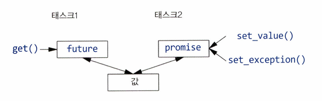

# 18강 : 동시 실행 - 작성자: 이솔

<aside>

# 🔎 단원 요약

- 동시성(concurrency) : 여러개의 computation이 시간 상 겹치도록 실행되는 것
</aside>

---

## 18.1 소개

동시성을 쓰는 이유

1. **throughput 향상**: 하나의 계산을 여러 조각으로 나눠 여러 코어에서 동시에 처리하면 전체 작업을 더 빨리 끝낼 수 있다.
2. **구조 개선 / 응답성 향상** — 논리적으로 서로 다른 일을 하나의 순차 코드 안에 억지로 섞지 않고, 각각을 독립된 흐름으로 분리해서 프로그램을 더 명확하게 만들고, 한쪽이 오래 걸려도 다른 쪽이 멈추지 않게 할 수 있다.

C++ 표준 라이브러리는 동시 실행을 지원하는 몇 가지 요소를 제공한다.

- `thread` — 동시에 실행되는 흐름 하나를 나타냄
- `mutex`, `scoped_lock` — 여러 스레드가 같은 데이터를 건드릴 때 충돌을 막음
- `condition_variable` — 어떤 조건이 만족될 때까지 기다렸다가 깨어남
- `promise`, `future`, `packaged_task` — 스레드 사이에서 결과값이나 예외를 주고받음
- `atomic` — 여러 스레드가 동시에 접근해도 안전한 기본 타입 연산

이 도구들은 대체로 저수준(low-level) 도구이기 때문에 실제 응용 프로그램을 만들 때는 이 도구들을 직접 쓰기보다, 이것들로 이미 만들어진 더 상위 수준의 라이브러리(병렬 알고리즘, 태스크 큐 등)를 쓰는 경우가 더 많다.

## 18.2 태스크와 스레드

- **태스크(task)**: 다른 태스크와 동시에 실행될 수 있는 계산 하나. 코드 상으로는 그냥 함수이거나, `operator()`를 정의한 함수 객체(function object)로 표현된다.
- **스레드(thread)**: 프로그램 안에서 하나의 태스크를 실제로 실행하는, 시스템 수준의 실행 단위다. C++에서는 `<thread>` 헤더의 `std::thread`로 다룬다.

`thread` 객체를 만들 때 생성자에 실행할 함수(또는 함수 객체)를 넘기면, 그 순간부터 새로운 스레드에서 해당 코드가 실행되기 시작한다.

```cpp
void greet() { std::cout << "hello from thread\n"; }

struct Greeter {
    void operator()() { std::cout << "hello from function object\n"; }
};

void run_both() {
    std::thread t1{greet};     // greet()가 별도 스레드에서 실행
    std::thread t2{Greeter{}}; // Greeter{}()가 별도 스레드에서 실행

    t1.join(); // t1이 끝날 때까지 기다림
    t2.join(); // t2가 끝날 때까지 기다림
}
```

***`join()`이 하는 일**: 호출한 스레드( run_both() )가 `t1`, `t2`가 끝날 때까지 멈춰서 기다리게 한다.
**`t1`, `t2`가 동시에 `std::cout`이라는 같은 자원에 쓰고 있으면 두 스레드의 출력이 한 줄 안에서 뒤섞여 나올 수 있다. 이렇게 여러 스레드가 같은 데이터(자원)를 보호 없이 동시에 건드려서 결과가 예측 불가능해지는 상황을 **데이터 레이스(data race)** 라고 부른다.

## 18.3 데이터 공유

### mutex

mutex(mutual exclusion object, 상호 배제 객체): 한 스레드가 쓰고 있으면 다른 스레드는 못 들어오게 막는 역할, 스레드는 `lock()`이라는 동작으로 이 mutex를 획득한다.

```cpp
mutex m;  // mutex 제어용 객체
int sh;   // 여러 스레드가 공유하는 데이터

void f()
{
  scoped_lock lck {m}; // mutex를 획득한다
  sh += 7;             // 공유 데이터를 조작한다
  // 함수가 끝나면 mutex를 암묵적으로 해제한다
}
```

1. `scoped_lock lck {m}`을 만드는 순간, `lck`의 생성자가 내부적으로 `m.lock()`을 호출해서 mutex를 잠근다.
2. 만약 다른 스레드가 이미 이 mutex를 잠가놓은 상태라면, 지금 이 스레드는 그냥 멈춰서 기다린다. 이걸 스레드가 블록된다고 표현한다.
3. 앞서 mutex를 갖고 있던 스레드가 자기 일을 끝내고 mutex를 해제하면, 기다리던 스레드가 깨어나서 이어서 실행된다.
4. `f()` 함수가 끝나면 `lck`이라는 객체가 사라지는데, 이때 `lck`의 소멸자가 자동으로 mutex를 풀어준다. 그래서 `sh += 7;` 다음 줄에 딱히 `unlock()`을 써주지 않아도 된다.

객체가 생성될 때 자원을 잡고, 객체가 없어질 때 자동으로 자원을 놓아주는 방식을 RAII라고 한다.

`scoped_lock`이 RAII 방식으로 만들어져 있어서, 직접 `lock()`/`unlock()`을 호출하는 것보다 훨씬 안전하다. 만약 함수 중간에 예외가 터지거나 return이 여러 군데 있어도, `lck`이 스코프를 벗어나는 순간 무조건 mutex는 풀리게 되어 있기 때문이다.

하지만 mutex가 어떤 데이터를 지키고 있는지 컴파일러가 자동으로 알아주지 않는다. 프로그래머가 스스로 규칙을 정해서 기억하는데, 흔히 쓰는 방법은 mutex를 아예 그 데이터를 담은 클래스 안에 멤버로 넣어버린다.

```cpp
class Record {
public:
  mutex rm;  // 이 mutex가 Record의 나머지 멤버를 지킨다는 뜻
  // ...
};
```

이렇게 해두면, 나중에 이 코드를 보는 사람이 `rec`라는 Record 객체를 쓰려면 먼저 `rec.rm`부터 잠그는 것을 자연스럽게 추측할 수 있다.

### deadlock

자원을 두 개 이상 동시에 써야 할 때

- 스레드1: mutex1을 먼저 잠그고, 그다음 mutex2를 잠그려고 시도
- 스레드2: mutex2를 먼저 잠그고, 그다음 mutex1을 잠그려고 시도

이 둘이 타이밍이 겹치면, 스레드1은 mutex2를 기다리고 스레드2는 mutex1을 기다리는 상태가 되어버려 서로가 서로를 기다리기만 하고 아무도 못 움직이는 상태가 된다.

`scoped_lock`에 mutex 여러 개를 한꺼번에 넘기면 해결된다.

```cpp
void f()
{
  scoped_lock lck {mutex1, mutex2, mutex3}; // 세 개를 한 번에 획득
  // ... 공유 데이터를 조작한다 ...
} // 세 mutex 모두 암묵적으로 해제
```

### 공유 데이터 방식의 한계

mutex로 데이터를 공유하는 방식은  프로그래머가 태스크의 언제 이 데이터를 건드리고, 언제 안 건드리는지를 스스로 다 신경 써야 하기 때문에 비효율적이다. 그래서 함수에 인자를 넘기고 결과를 돌려받는 방식이 더 명확할 때가 많다(뒤에 나옴).

한편 인자를 복사해서 넘기는 것보다 그냥 공유해서 쓰는 게 효율적이라고 생각하기 쉬운데, 하지만 락을 걸고 푸는 것 자체도 비용이 꽤 크고, 요즘은 `vector`처럼 데이터를 복사하는 것도 매우 빠르다.

### shared_mutex

데이터 공유의 흔한 패턴 중 하나가 여러 개가 읽기만 하고, 하나만 쓰는 상황인데, 이 때 기본  mutex를 쓰면 읽기만 하는 스레드끼리도 서로 기다려야 하기 떄문에 손해이다. 이런 경우를 위해 shared_mutex를 사용한다.

```cpp
shared_mutex mx; // 공유 가능한 뮤텍스

void reader()
{
  shared_lock lck {mx}; // 다른 reader와 동시 접근을 허용한다
  // ... 읽는다 ...
}

void writer()
{
  unique_lock lck {mx}; // 나 혼자만 접근해야 한다 (배타적)
  // ... 쓴다 ...
}
```

`reader()`는 `shared_lock`을 써서 여러 reader가 동시에 읽을 수 있는 반면 writer가 쓰는 동안에는 reader든 다른 writer든 아무도 들어올 수 없다.

#### atomic - mutex보다 가벼운 대안

mutex는 운영체제까지 관여하는 무거운 장치이므로, 값 하나 정도를 지킬 때는 atomic을 사용하여 간단하고 저렴한 방식으로 데이터 경합을 막는다.

```cpp
mutex mut;
atomic<bool> init_x;  // 처음엔 false
X x;                   // 초기화하는 데 손이 많이 가는 변수

if (!init_x) {
  lock_guard lck {mut};
  if (!init_x) {
    // ... x를 실제로 초기화한다 ...
    init_x = true;
  }
}
// ... 이후로는 x를 사용한다 ...
```

1. 바깥의 `if (!init_x)`는 mutex를 잠그지 않고 그냥 값만 확인하며, 이미 초기화가 끝났으면(대부분의 경우) 그냥 바로 통과해서 무거운 mutex를 건드리지 않는다.
2. 아직 초기화가 안 됐다면 그때 `lock_guard`로 mutex를 잠근다.
3. 잠근 다음 다시 한 번 `if (!init_x)`를 확인하는 이유는, 내가 바깥에서 확인한 순간과 mutex를 잠근 순간 사이에 다른 스레드가 먼저 초기화를 끝내버렸을 수도 있기 때문이다.
4. 안쪽 확인까지 통과했을 때만 실제로 초기화를 진행하고 `init_x = true`로 표시한다

*`init_x`는 반드시 `atomic<bool>`이어야 한다. 만약 그냥  `bool`로 선언하면 이 변수 자체에 대한 데이터 경합이 생겨서 아주 드물게, 그리고 원인을 찾기 힘든 방식으로 초기화가 실패할 수 있다.

**잠글 mutex가 여러개일 경우, 이 예시인 lock_guard 대신 scoped_lock을 사용한다.

## 18.4 이벤트 대기

스레드는 가끔 **다른 스레드가 뭔가를 끝낼 때까지**, 혹은 **특정 시간이 지날 때까지** 멈춰서 기다려야 한다. 이렇게 기다리는 대상을 "이벤트"라고 부른다.

```cpp
using namespace chrono; // 16.2.1절 참고

auto t0 = high_resolution_clock::now();
this_thread::sleep_for(milliseconds{20});
auto t1 = high_resolution_clock::now();

cout << duration_cast<nanoseconds>(t1-t0).count() << " nanoseconds passed\n";
```

가장 쉬운 형태의 이벤트 대기는 시간이 흐르길 기다리는 것이다. `this_thread::sleep_for(milliseconds{20})`는 지금 실행 중인 스레드를 20밀리초 동안 멈추게 한다.

여기서 `this_thread`는 지금 이 코드를 실행하고 있는 바로 그 스레드 자신을 가리킨다. 그래서 `thread` 객체를 따로 만들 필요 없이 그냥 현재 흐름을 잠깐 멈추는 용도로 사용한다.
`t0`, `t1`은 `high_resolution_clock::now()`로 잰 시각이고, 그 차이를 `duration_cast<nanoseconds>`로 나노초 단위로 바꿔서 실제로 얼마나 시간이 흘렀는지 출력한다.

### condition_variable

`<condition_variable>` 헤더에 있는 `condition_variable`은 한 스레드가 다른 스레드의 작업 결과를 기다리게 해주는 메커니즘이이다. 어떤 조건(주로 이벤트)이 만족될 때까지 잠들어 있다가, 그 조건이 만족됐다는 신호가 오면 깨어나는 방식으로 동작한다.

주로 한 스레드(생산자)가 큐에 작업을 채워 넣고, 다른 스레드(소비자)가 그 큐에서 작업을 꺼내 처리하는 생산자-소비자 패턴으로 사용된다.

```cpp
class Message {
  // ... 통신할 내용을 담는 객체 ...
};

queue<Message> mqueue;     // 메시지를 담아두는 큐
condition_variable mcond;  // 이벤트를 알리는 데 쓰는 변수
mutex mmutex;               // mqueue와 mcond를 보호하는 뮤텍스

============================================================================
consumer code
void consumer()
{
  while(true) {
    unique_lock lck {mmutex};                        // ① mmutex를 획득
    mcond.wait(lck, [] { return !mqueue.empty(); });  // ② 조건이 참이 될 때까지 대기

    auto m = mqueue.front();  // ③ 메시지를 꺼내온다
    mqueue.pop();
    lck.unlock();              // ④ mmutex를 해제한다
    // ... m을 처리한다 ...
  }
}

============================================================================
producer code
void producer()
{
  while(true) {
    Message m;
    // ... 메시지를 채운다 ...
    scoped_lock lck {mmutex}; // 연산을 보호한다
    mqueue.push(m);
    mcond.notify_one();        // 알린다
    // (범위 끝에서) mmutex를 해제한다
  }
}
```

consumer()

1. 이제 곧 큐 상태를 확인할 거니까 다른 스레드가 큐를 못 건드리게 `unique_lock lck {mmutex}`로 먼저 뮤텍스를 잠근다. 
2.  `mcond.wait(lck, 조건)` 안에서
    - 넘겨준 조건(`!mqueue.empty()`,  큐가 비어있지 않은지)을 확인한다.
    - 조건이 이미 참이면 그냥 통과한다.
    - 조건이 거짓이면, `lck`이 잡고 있던 `mmutex`를 **일단 풀어주고** 스레드를 잠재운다.
    - 나중에 다른 스레드가 `notify_one()`을 호출하면 깨어나는데, 깨어나자마자 `mmutex`를 **다시 잠근 다음** 조건을 재확인한다.
    - 조건이 참이면 `wait()`을 빠져나가고, 거짓이면 다시 잠든다.

 `notify_one()`으로 깨어나긴 했는데, 그 사이에 **다른 소비자 스레드가 먼저 큐의 메시지를 가져가 버렸을 수도 있는 상태에서** 그럴 때 조건 없이 무작정 깨어나서 큐를 건드리면 빈 큐에서 뭔가를 꺼내려는 오류가 생길 수 있기 때문에, 조건을 람다로 명시하여 깨어난 다음 진짜로 조건이 만족됐는지를 다시 검사한다.

1.  조건을 통과했으니 이제 큐 맨 앞의 메시지를 꺼내고 큐에서 제거한다.
2.  `lck.unlock()`으로 명시적으로 뮤텍스를 푼다. 메시지 실제 처리(`m`을 가지고 뭔가 하는 작업)는 굳이 뮤텍스를 잡은 채로 할 필요가 없으니, 처리를 시작하기 전에 미리 풀어줘서 다른 스레드가 큐에 접근할 수 있게 열어준다.

producer()

1. 메시지 `m`을 채운다.
2. `scoped_lock lck {mmutex}`로 뮤텍스를 잠근다. 여기서는 락을 옮기거나 중간에 풀 필요가 없으니 그냥 `scoped_lock`으로 충분하다.
3. `mqueue.push(m)`로 큐에 메시지를 넣는다.
4. `mcond.notify_one()`으로 조건이 바뀌었을 수도 있다는 신호를 보낸다. 이 호출은 `wait()`으로 잠들어 있는 스레드 중 하나를 깨운다(정확히는 깨울 준비를 시킨다 — 실제로 실행을 재개하려면 그 스레드가 뮤텍스도 다시 잡을 수 있어야 함).
5. 함수 블록이 끝나면서 `lck`이 소멸되고, 그 순간 뮤텍스가 풀린다.

- 생산자는 "뮤텍스 잠그고 → 큐에 넣고 → 신호 보내고 → 뮤텍스 풀기"를 반복한다.
- 소비자는 "뮤텍스 잠그고 → 큐가 빌 때까지 잠들었다 깨어나기를 반복 → 큐에서 꺼내고 → 뮤텍스 풀고 → 처리"를 반복한다.

## 18.5 태스크 커뮤니케이션

지금까지 배운 `thread` + `mutex` + `condition_variable` 조합은 전부 **저수준** 도구로, 두 스레드가 값을 주고받으려면 뮤텍스를 만들고, 잠그고, 조건 변수로 신호를 보내야 했다.

18.5절에서는 이런 저수준 관리를 대신해주며 태스크 단위로 사고할 수 있게 해주는 세 가지 도구를 소개한다. 

- **future와 promise**: 스레드 하나가 계산한 값을 다른 스레드로 넘겨주는 통로
- **packaged_task**: 태스크를 future/promise에 자동으로 연결해주는 래퍼
- **async()**: 함수 호출하듯 태스크를 실행시키는 가장 간단한 방법

모두 `<future>` 헤더에 들어있다.

### 18.5.1 future 와 promise

`promise`와 `future`는 항상 짝을 이뤄서 스레드 사이에 값(또는 예외) 하나를 넘겨주는 역할을 한다.

- **promise**: 값을 만든 쪽이 들고 있는 객체. `set_value()`로 값을 넣거나, `set_exception()`으로 예외를 넣는다.
- **future**: 값을 받을 쪽이 들고 있는 객체. `get()`을 부르면 값을 받는다.



태스크2가 `promise`에 값을 넣으면, 태스크1이 대응하는 `future`에서 `get()`으로 그 값을 꺼내가는 구조로, fx라는 future<X>가 있을 떄, 타입 X의 값을 아래처럼 get()할 수 있다.

```cpp
X v = fx.get() // 값이 준비될 때까지 필요하면 기다린다
```

- 값이 이미 준비돼 있으면 바로 돌려준다.
- 아직 준비 안 됐으면, 준비될 때까지 이 스레드는 블록(대기)된다.
- `promise` 쪽에서 값 대신 예외를 넣었으면, `get()`이 그 예외를 그대로 다시 던진다

```cpp
promise를 채우는 쪽 — f()

void f(promise<X>& px) // 결과를 px에 넣는 태스크
{
    try {
        X res;
        // ... res 값을 계산한다 ...
        px.set_value(res);
    }
    catch (...) { // res를 계산하다 문제가 생겼다면
        px.set_exception(current_exception()); // 예외를 future 쪽으로 넘긴다
    }
}
================================================================================
future를 꺼내는 쪽 — g()

void g(future<X>& fx) // fx로부터 결과를 가져오는 태스크
{
    try {
        X v = fx.get(); // 필요하면 계산이 끝날 때까지 기다린다
        // ... v를 사용한다 ...
    }
    catch (...) { // 누군가 v를 계산하지 못했다면
        // ... 오류 처리 ...
    }
}
```

f()에서는 계산이 성공하면 `set_value()`로 결과를 넣고, 계산 중 예외가 터지면 `catch(...)`로 그 예외를 잡아서 `current_exception()`(방금 잡은 예외를 가리키는 핸들)을 통째로 `set_exception()`에 넘겨. 그러면 이 예외가 `future` 쪽으로 그대로 전달한다.

`f()`에서 예외가 났다면, `g()`의 `fx.get()`이 바로 그 예외를 다시 던져줘서 여기서 잡을 수 있다.

굳이 오류처리를 안해도 되는 상황이라면 아래처럼 짧게 쓸 수도 있다.

```cpp
void g(future<X>& fx)
{
    X v = fx.get(); // 필요하면 기다린다
    // ... v를 사용한다 ...
}
```

### 18.5.2 packaged_task

방금 본 방식대로 하려면, `promise`를 만들고, 그걸 태스크 함수에 넘기고, 대응하는 `future`를 만들고, 스레드를 시작시키켜야한다. `packaged_task`는 이 과정을 자동화해주는 래퍼로, 어떤 함수를 감싸두면, 그 함수가 반환하는 값이든 던지는 예외든 알아서 내부 `promise`에 담아주고 / `get_future()`를 부르면 그 `promise`와 짝을 이루는 `future`를 돌려받는다.

```cpp
//벡터를 반으로 나눠 병렬로 합산
double accum(span<double> s, double init)
    // [beg:end) 범위의 합을 init부터 시작해서 계산한다
{
    return accumulate(s.begin(), s.end(), init);
}

double comp2(vector<double>& v)
{
    packaged_task<double(span<double>, double)> pt0{accum}; // accum을 태스크로 감싼다
    packaged_task<double(span<double>, double)> pt1{accum};

    future<double> f0{pt0.get_future()}; // pt0과 짝이 되는 future를 얻는다
    future<double> f1{pt1.get_future()}; // pt1과 짝이 되는 future를 얻는다

    double* first = &v[0];
    auto half = v.size() / 2;

    jthread t1{move(pt0), span<double>{first, half}, 0.0};        // 앞쪽 절반을 처리
    jthread t2{move(pt1), span<double>{first + half, half}, 0.0}; // 뒤쪽 절반을 처리

    return f0.get() + f1.get(); // 두 결과를 모아 합친다
}
```

1. `accum`이라는 함수를 `packaged_task`로 두 개(`pt0`, `pt1`) 감싼다. 이제 `pt0`, `pt1`은 accum을 호출하고, 그 결과를 자동으로 promise에 넣어주는 객체가 됐다.
2. `pt0.get_future()`, `pt1.get_future()`로 각각 짝이 되는 `future`를 미리 받아둔다. (실제 스레드는 다음 단계의 `jthread`에서 시작된다.)
3. `jthread t1{move(pt0), ...}`로 실제 스레드를 시작한다. 이때 `pt0`을 그냥 넘기지 않고 `move(pt0)`로 넘긴 이유는, `packaged_task`가 자기 안의 `promise`를 직접 소유하는 자원 핸들이라서 **복사가 안 되기** 때문이다. 반드시 이동시켜야한다.
4. `f0.get() + f1.get()`으로 두 스레드의 결과를 각각 기다렸다가 받아서 더한다.

### 18.5.3 async()

`packaged_task` + `jthread` 조합도 나쁘지 않지만, 그냥 이 함수를 비동기로 실행해줘라고 요청만 하고 싶을 때는 `async()`가 더 간단하다.

```cpp
double comp4(vector<double>& v)
    // v가 충분히 크면 여러 태스크로 나눠서 처리한다
{
    if (v.size() < 10000) // 굳이 나눠서 처리할 가치가 있는가?
        return accum(v.begin(), v.end(), 0.0);

    auto v0 = &v[0];
    auto sz = v.size();

    auto f0 = async(accum, v0,          v0 + sz/4,   0.0); // 1구간
    auto f1 = async(accum, v0 + sz/4,   v0 + sz/2,   0.0); // 2구간
    auto f2 = async(accum, v0 + sz/2,   v0 + sz*3/4, 0.0); // 3구간
    auto f3 = async(accum, v0 + sz*3/4, v0 + sz,     0.0); // 4구간

    return f0.get() + f1.get() + f2.get() + f3.get(); // 네 결과를 합친다
}
```

`async(함수, 인자들...)`을 부르면 곧바로 `future`를 하나 돌려받는다. 나중에 `get()`으로 결과를 받으면 끝이야. `thread`도, `packaged_task`도 직접 만들 필요가 없다. `async()`는 **함수를 호출하는 부분**과 **결과를 받는 부분**을 분리해주고, 그 둘을 다시 **태스크가 실제로 실행되는 부분**과도 분리해준다. 그래서 프로그래머는 스레드나 락 대신 이 계산이 비동기적으로 이뤄질 수도 있다는 관점으로만 생각하면 된다.

#### 한계

1. **락이 필요한 자원을 공유하는 태스크에는 async()를 쓰면 안 된다.** async()가 스레드를 어떻게 굴릴지 프로그래머가 통제할 수 없기 때문에, 락과 얽히면 예측하기 어려운 상황이 생긴다.
2. **몇 개의 스레드가 실제로 쓰일지 알 수 없다.** `async()`는 호출되는 그 순간 시스템에 남아있는 자원(놀고 있는 코어가 몇 개인지 등)을 확인하고 나서 스레드를 몇 개나 쓸지 결정하므로, 매번 다르게 동작할 수 있다. 심지어 상황에 따라선 별도 스레드를 만들지 않고, `get()`이 호출되는 시점에 호출한 스레드에서 그냥 순서대로 실행해버릴 수도 있다.
3. **`v.size() < 10000` 같은 기준은 대략적인 어림짐작이다.** 스레드를 새로 만드는 비용과 계산 자체의 비용을 비교하는 정확한 방법은 이 책 범위를 넘어서니까, 이런 임계값은 "대충 이 정도부터 나눠볼 만하다"는 감으로만 받아들이라고 책은 말한다.
4. **`accumulate()` 같은 표준 알고리즘은 이렇게 수동으로 안 나눠도 된다.** `reduce(par_unseq, ...)` 같은 병렬 실행 정책을 쓰는 알고리즘이 이미 이런 걸 대개 더 잘 해준다.(17.3.1절 내용). 다만 여기서 보여준 "태스크 나누기" 기법 자체는 다른 상황에도 두루 쓸 수 있는 보편적인 기법이다.
5. **async()가 오직 성능을 위한 도구는 아니다.** 예를 들어 메인 프로그램은 계속 반응하는 상태로 놔두면서, 사용자 입력 같은 걸 받아오는 별도 작업을 `async()`로 슬쩍 띄워두는 용도로도 쓸 수 있다.

### 18.5.4 thread 중지

#### 왜 그냥 죽이면 안 되나

결과가 더 이상 필요 없어진 스레드는 멈추고 싶어질 때가 있는데, 스레드는 락, 하위 스레드, 데이터베이스 연결 같은 자원을 들고 있을 수 있어서, 그냥 강제로 죽이면 그 자원들이 제대로 정리가 안 될 수 있다. 그래서 표준 라이브러리는 스레드에게 중지를 요청하는 `stop_token`이라는 메커니즘을 제공한다.

#### 예제: 두 스레드로 나눠서 검색하기

여러 스레드를 동시에 띄워서 뭔가를 찾다가, 하나가 답을 찾으면 나머지는 더 찾을 필요 없이 멈추게 하는 `find_any()`를 살펴보자.

```cpp
atomic<int> result = -1; // 찾은 위치의 인덱스, 아직 없으면 -1

template<class T>
struct Range { T* first; T* last; }; // 범위를 넘기기 위한 간단한 구조체

void find(stop_token tok, const string* base, const Range<string>& r, const string target)
{
    for (string* p = r.first; p != r.last && !tok.stop_requested(); ++p)
        if (match(*p, target)) {   // match()는 두 문자열이 조건에 맞는지 검사
            result = p - base;     // 찾은 원소의 인덱스를 저장
            return;
        }
}
```

- `tok`은 `stop_token` 타입이다. 반복문 안에서 `!tok.stop_requested()`를 매번 확인하는데, 이건 다른 스레드가 나한테 그만하라고 요청했는지를 검사한다. 요청이 왔으면 반복문을 빠져나가고 함수를 끝낸다.
- 찾았으면 `result`(전역 `atomic<int>`)에 인덱스를 기록하고 리턴한다.

```cpp
void find_any(vector<string>& vs, const string& key)
{
    int mid = vs.size() / 2;
    string* pvs = &vs[0];

    stop_source ss1{};
    jthread t1(find, ss1.get_token(), pvs, Range{pvs, pvs + mid}, key); // 앞쪽 절반 검색

    stop_source ss2{};
    jthread t2(find, ss2.get_token(), pvs, Range{pvs + mid, pvs + vs.size()}, key); // 뒤쪽 절반 검색

    while (result == -1)
        this_thread::sleep_for(10ms); // 결과가 나올 때까지 주기적으로 확인

    ss1.request_stop(); // 결과가 나왔으니 두 스레드 모두 중지 요청
    ss2.request_stop();

    // ... result를 이용한다 ...
}
```

1. `stop_source ss1{}`를 만든다. `stop_source`는 그 스레드에게 중지 요청을 보낼 수 있는 리모컨같은 객체이고, `ss1.get_token()`으로 그 리모컨에 대응하는 `stop_token`을 뽑아낸다.
2. `jthread t1(find, ss1.get_token(), ...)`으로 `find()`를 실행하는 스레드를 시작하면서, 이 `stop_token`을 함께 넘긴다. `t2`도 마찬가지로 나머지 절반을 맡는다.
3. 메인 스레드는 `result`가 여전히 `1`인 동안 10밀리초마다 한 번씩 깨서 확인한다(`atomic` 변수에 결과를 넣고 그 변수를 반복해서 확인하는 스핀 루프 방식.
4. 둘 중 하나가 먼저 찾아서 `result`를 -1이 아닌 값으로 바꾸면, 반복문을 빠져나와 `ss1.request_stop()`, `ss2.request_stop()`을 호출한다. 이 요청이 각 스레드 안의 `tok.stop_requested()`를 참으로 만들어서, 아직 찾는 중이던 스레드도 다음 반복에서 스스로 멈추게 된다.

즉, `stop_source`가 중지 요청을 보내는 주체이고, 거기서 만들어진 `stop_token`이 각 스레드로 전달돼서 지금 중지 요청이 왔는지를 안전하게(데이터 경합 없이) 확인할 수 있게 해주는 구조이다.

## 18.6 코루틴

호출과 호출 사이에 상태를 유지하는 함수

operator()를 가진 클래스와 다른 점: 함수 객체는 **프로그래머가 직접** 상태를 멤버 변수로 만들어서 관리해야 하는 반면, 코루틴은 **언어 차원에서 암묵적으로, 그리고 완벽하게** 호출 사이의 상태를 저장했다가 복구한다. (여기서 상태란 사실 그 함수의 스택 프레임(지역 변수들, 실행 중이던 위치 등) 전체를 말한다.)

```cpp
generator<long long> fib() // 피보나치 수를 생성한다
{
    long long a = 0;
    long long b = 1;
    while (a < b) {
        auto next = a + b;
        co_yield next;   // 상태를 저장하고, 값을 반환하고, 기다린다
        a = b;
        b = next;
    }
    co_return 0;          // 너무 큰 수에 도달했을 때
}

```

일반 함수의 `return`은 값을 돌려주고 함수를 **끝내버리지만**, `co_yield`는:

1. 지금까지의 지역 변수 값(`a`, `b` 등)과 "코드의 어느 지점을 실행 중이었는지"를 통째로 저장하고
2. 오른쪽에 적힌 값(`next`)을 호출한 쪽으로 돌려주고
3. 그 자리에서 실행을 잠깐 멈춘다(하지만 함수가 끝난 건 아니다)

그러다가 이 코루틴이 다시 재개(resume)되면, 방금 멈췄던 바로 그 지점(`co_yield next;` 다음 줄인 `a = b;`)부터 이어서 실행된다.

`co_return 0;`은 반대로 값을 돌려주면서 **코루틴을 완전히 종료**시킨다.

이렇게 계속 재개될 때마다 다음 피보나치 수를 하나씩 내어주기 때문에, 이 코루틴을 반복해서 호출하면 `1 2 3 5 8 13 ...` 같은 피보나치 수열이 하나씩 생성되는 것이다.

**코루틴은 호출 사이에 자신의 스택 프레임을 저장하는 함수**다. 일반 함수는 호출이 끝나면 스택 프레임(지역 변수들이 쌓여있던 메모리 영역)이 사라지지만, 코루틴은 `co_yield`로 멈출 때 그 스택 프레임을 어딘가(주로 힙)에 보관해뒀다가, 재개될 때 그걸 그대로 복원해서 이어간다.

만약 이걸 코루틴 없이 함수 객체(`Fib`라는 클래스)로 직접 구현하려면, `a`, `b` 같은 상태를 전부 멤버 변수로 만들고, 매번 어디까지 진행됐는지도 직접 추적해야한다. 

계산이 복잡해질수록 상태 저장/복구를 손으로 하는 게 점점 장황해지고, 최적화하기도 어려워지고, 실수하기도 쉬워져서 코루틴을 이용하여 컴파일러에게 대신 맡기는 것.

#### 동기식 코루틴 vs 비동기식 코루틴

- **동기식**: 호출한 쪽이 결과가 나올 때까지 그냥 기다린다. ex)피보나치 예제 — `fib()`을 부르면 값이 나올 때까지 딱히 다른 일을 안 하고 기다린다.
- **비동기식**: 코루틴이 결과를 계산하는 동안 호출한 쪽은 다른 작업을 계속 수행하다가, 나중에 결과를 확인한다.

동기식은 컴파일러가 최적화하기 좋다. 예를 들어 위 피보나치 예제처럼 흐름이 다 예측 가능하면, 좋은 컴파일러는 `fib()` 호출을 아예 그 자리에 풀어서 써넣고(인라인), 루프도 다 펼쳐서(언롤), 최종적으로는

```cpp
cout << "1 2 3 5 8 13"; // fib(6)
```

이런 식으로 실행 시점에 아무 계산도 안 하고 그냥 문자열을 찍는 코드로까지 최적화해버릴 수 있다.

코루틴은 아주 다양한 용도에 쓸 수 있도록 굉장히 유연하게, 그리고 저수준으로 설계된 프레임워크야. 표준화 위원회가 설계에 관여하긴 했지만 기본적으로는 "전문가에 의해, 전문가를 위해" 만들어졌다고한다. 
일반 사용자가 쉽게 쓸 수 있는 **`generator` 같은 편의 타입이 아직 C++20 표준 라이브러리에는 안 들어갔다**는 거야. 표준화가 제안 중인 상태고, 그때까지는 `[Cppcoro]` 같은 외부 라이브러리를 웹에서 찾아써야 한다.

### 18.6.1 협력적 멀티태스킹 — 이벤트 주도 시뮬레이션

복잡한 작업을, 서로 협력하는 여러 개의 간단한 태스크(코루틴)들의 네트워크로 표현하자.

- 호출 사이에 상태를 유지하는 다양한 코루틴들
- 그 코루틴들을 담아두는 이벤트 리스트를 관리하고, 코루틴의 구체적인 타입이 뭐든 상관없이 똑같은 방식으로 호출할 수 있게 해주는 **다형성(polymorphism)**
- 리스트에서 다음에 실행할 코루틴을 골라주는 **스케줄러**

#### 왜 스레드가 아니라 코루틴인가

책 예제에서는 코루틴 2개를 번갈아 실행하는 정도의 작은 시스템을 보여주지만, 실제로 이런 시스템은 태스크가 수백~수천 개까지 늘어날 수 있는데,

- 스레드 하나 = 보통 1~2MB(대부분 스택으로 쓰임)
- 코루틴 하나 = 대개 약 20~30B

대량의 작은 태스크를 다루는 시뮬레이션에는 스레드보다 코루틴이 훨씬 적합하다.

#### 1단계: 다형성 뼈대 만들기 — Event_base / Event

우선 "종류가 서로 다른 코루틴들을 똑같은 방식으로 호출"하기 위한 기반을 만든다.

```cpp
struct Event_base {
    virtual void operator()() = 0;
    virtual ~Event_base() {}
};

template<class Act>
struct Event : Event_base {
    Event(const string n, Act a) : name{n}, act{move(a)} {}
    string name;
    Act act;
    void operator()() override { act(); }
};
```

- `Event_base`는 순수 가상 함수 `operator()`만 있는 기반 클래스이다. 이게 있어서 실제 타입이 뭐든(`Event<이런저런 Act>`) `Event_base*` 포인터 하나로 통일해서 다룰 수 있다.
- `Event<Act>`는 실제로 실행할 행동(`act`, 전형적으로 코루틴)을 저장하는 클래스이다. `operator()`가 호출되면 그냥 저장해둔 `act()`를 실행해준다.

사용 예시

```cpp
void test()
{
    vector<Event_base*> events = { // 코루틴을 저장할 2개의 Event를 생성한다
        new Event{ "integers ", sequencer(10) },
        new Event{ "chars ",    char_seq('a') }
    };

    vector order {0, 1, 1, 0, 1, 0, 1, 0}; // 어떤 순서로 실행할지 고른다

    for (int x : order) // order대로 코루틴을 호출한다
        (*events[x])();

    for (auto p : events) // 해제
        delete p;
}
```

- `events`에는 서로 다른 코루틴(`sequencer(10)`, `char_seq('a')`)을 각각 감싼 `Event` 객체 2개가 들어있다.
- `order`는 "0번 이벤트, 1번 이벤트, 1번, 0번, ..." 이런 식으로 어느 태스크를 언제 실행할지 정한 순서로, 스케줄러 역할을 한다.
- 반복문에서 `(*events[x])()`로 그 순서대로 각 이벤트를 호출하여 `events[x]`는 `Event_base*`니까, 실제로 어떤 구체 타입(`Event<sequencer의 반환 타입>`인지 `Event<char_seq의 반환 타입>`인지)인지 몰라도 다 똑같이 `operator()`로 호출할 수 있다.(다형성 부분)

여기까지는 그냥 서로 다른 타입의 객체들을 균일하게 다루는 전통적인 객체지향 코드이다.

```cpp
task sequencer(int start, int step = 1)
{
    auto value = start;
    while (true) {
        cout << "value: " << value << '\n'; // 결과를 커뮤니케이션한다
        co_yield 0;      // 누군가 이 코루틴을 재개할 때까지 슬립한다
        value += step;   // 상태를 업데이트한다
    }
}
```

`co_yield`가 호출될 때마다 `value`라는 상태(그리고 루프의 어느 지점을 실행 중이었는지)를 저장해두고 그 자리에서 멈춘 다음 나중에 누군가 이 코루틴을 다시 재개하면 멈췄던 지점 바로 다음인 `value += step;`부터 이어서 실행돼서 값이 하나 늘어나고, 다시 값을 출력하고, 또 `co_yield`로 멈추기를 반복한다. 

```cpp
task char_seq(char start)
{
    auto value = start;
    while (true) {
        cout << "value: " << value << '\n'; // 결과를 커뮤니케이션한다
        co_yield 0;
        ++value;
    }
}
```

서로 다른 타입의 코루틴도 `Event_base*` 하나로 똑같이 다룰 수 있다

`equencer`와 `char_seq`가 반환하는 타입이 `task`인데, 

`task`는:

- 코루틴이 멈출 때마다 그 상태(사실상 함수의 스택 프레임)를 저장해두고
- `co_yield`가 정확히 뭘 의미하는지(어떤 값을 어떻게 넘기고 어떻게 멈출지)를 정의하는 역할을 한다.

사용자 입장(`sequencer`, `char_seq`를 그냥 갖다 쓰는 입장)에서는 `task`가 하는 일: 코루틴을 호출할 수 있는 `operator()`만 제공한다.

```cpp
struct task {
    void operator()() { coro.resume(); }

    struct promise_type {                                       // 언어 기능과의 매핑
        suspend_always initial_suspend() { return {}; }
        suspend_always final_suspend() noexcept { return {}; }   // co_return 처리
        suspend_always yield_value(int) { return {}; }           // co_yield 처리
        auto get_return_object() { return task{ handle_type::from_promise(*this) }; }
        void return_void() {}
        void unhandled_exception() { exit(1); }
    };

    using handle_type = coroutine_handle<promise_type>;
    task(handle_type h) : coro(h) { }  // get_return_object()가 호출
    handle_type coro;                   // 코루틴 핸들
};
```

- `task` 안의 `coro`는 실제 코루틴을 가리키는 핸들로, `operator()`가 호출되면 `coro.resume()`으로 그 코루틴을 재개시킨다.
- 내부의 `promise_type`이라는 중첩 구조체가 "이 코루틴이 시작할 때, `co_yield`를 만났을 때, 끝날 때 각각 무슨 일이 일어나야 하는지"를 컴파일러에게 알려주는 역할을 하고, 이게 바로 `co_yield`, `co_return` 같은 키워드들이 실제로 어떤 동작으로 연결되는지를 정의하는 부분이다.

**라이브러리를 직접 만드는 사람이 아니라면, 이런 코드는 절대 직접 작성하지 말라고 경고한다**. 이건 코루틴이라는 언어 기능을 실제로 동작하게 만드는 아주 저수준의 배관 코드라서, 대부분의 사용자는 이런 걸 직접 짤 필요 없이 나중에 나올 표준 라이브러리의 `task`, `generator` 같은 완성된 타입을 가져다 쓰기만 하면 된다.